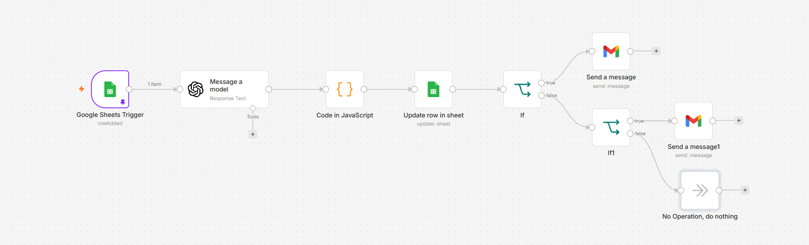
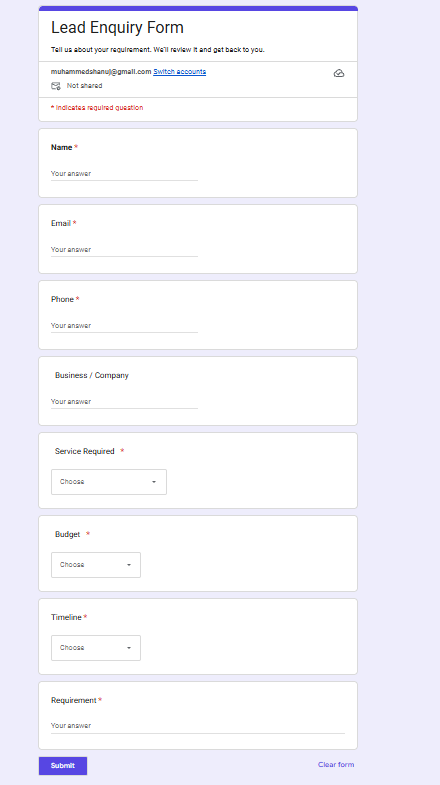
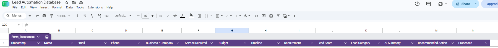
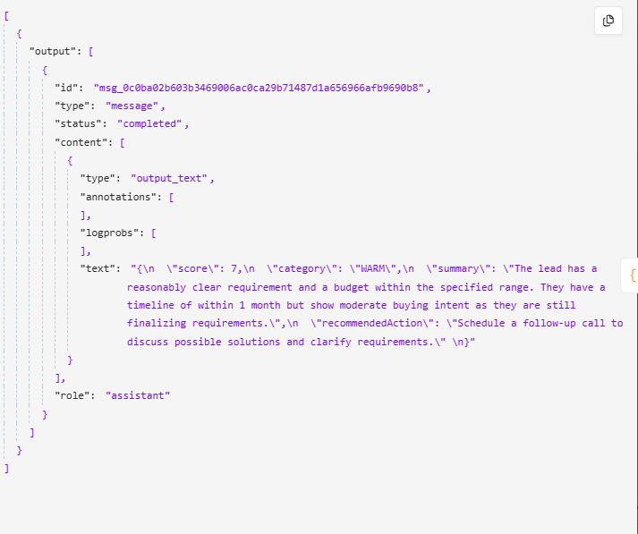
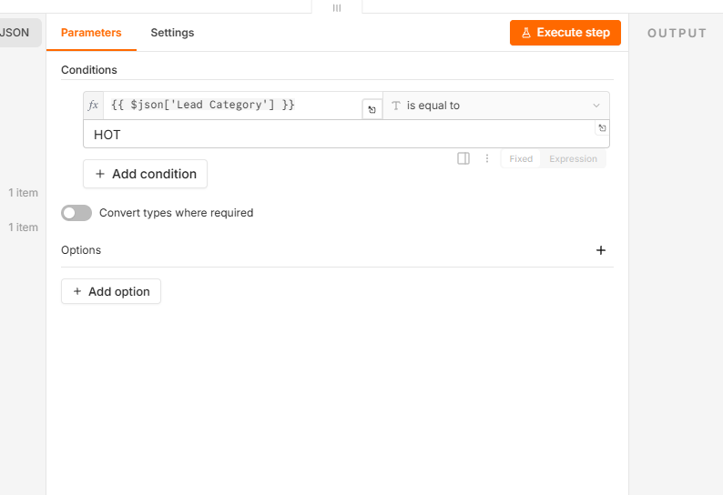
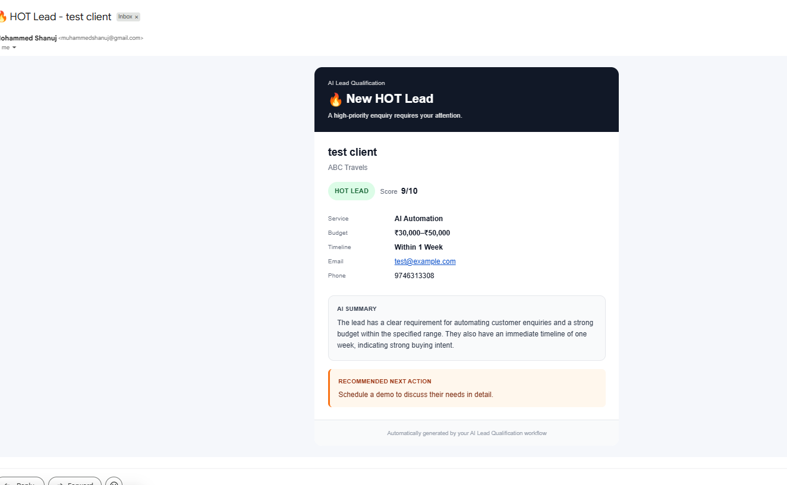
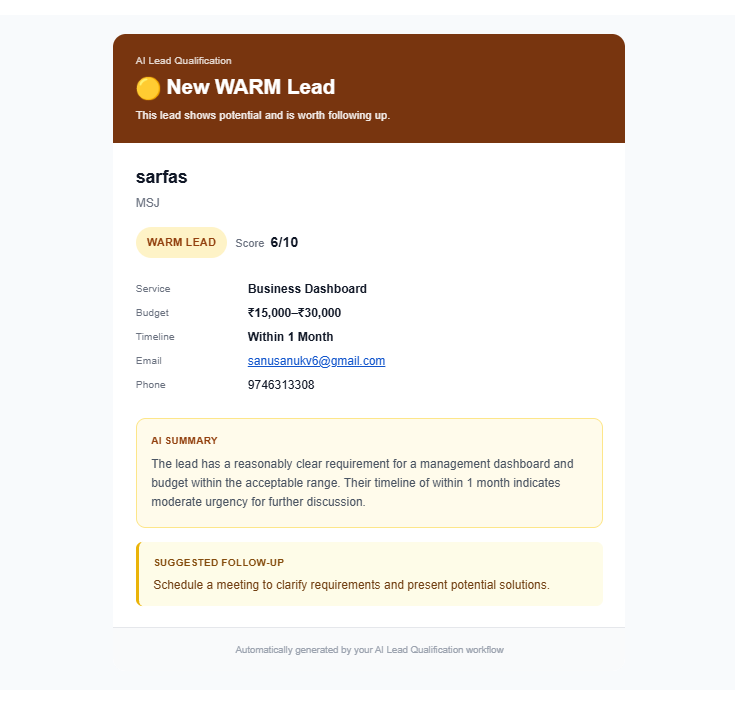

# AI Lead Qualification Automation

An end-to-end AI-powered lead qualification workflow built with **n8n, Google Forms, Google Sheets, OpenAI, JavaScript, and Gmail**.

The workflow captures incoming business enquiries, evaluates them with an LLM, converts the model response into structured JSON, updates the lead database, and routes leads based on priority.

> **Portfolio note:** Demo/test lead data is used in this repository. Personal details shown in screenshots have been sanitized for public sharing.

## What this project solves

Sales teams often receive many enquiries but cannot manually review every lead immediately. This automation helps prioritize leads by automatically generating:

- Lead score from 1–10
- HOT / WARM / COLD category
- AI-generated summary
- Recommended next action
- Automatic lead database updates
- Priority-based Gmail notifications

## Architecture

```text
Google Form
   ↓
Google Sheets
   ↓
Google Sheets Trigger (n8n)
   ↓
OpenAI — Lead Qualification
   ↓
JavaScript — Parse Structured JSON
   ↓
Update Google Sheet
   ↓
IF — HOT?
 ┌───────────────┴───────────────┐
 ↓ true                          ↓ false
HOT Gmail                    IF — WARM?
                              ┌────┴────┐
                              ↓ true    ↓ false
                         WARM Gmail    COLD → Do Nothing
```



## Lead enquiry form

The workflow starts with a Google Form that collects:

- Name
- Email
- Phone
- Business / Company
- Service Required
- Budget
- Timeline
- Requirement



## Lead database

Every form submission is stored in Google Sheets. The automation enriches each row with:

- `Lead Score`
- `Lead Category`
- `AI Summary`
- `Recommended Action`
- `Processed`



## AI qualification output

The LLM returns structured JSON that downstream nodes can consume reliably.

Example shape:

```json
{
  "score": 7,
  "category": "WARM",
  "summary": "The lead has a reasonably clear requirement and a budget within the specified range.",
  "recommendedAction": "Schedule a follow-up call to clarify requirements and discuss possible solutions."
}
```



## Routing logic

The workflow first checks whether the lead is `HOT`. If not, it checks whether the lead is `WARM`. COLD leads are recorded but do not trigger an email notification.



## HOT lead notification

HOT leads receive an immediate styled HTML email with lead details, score, AI summary, and recommended action.



## WARM lead notification

WARM leads receive a calmer follow-up email designed for leads that show potential but are not urgent.



## Lead categories

| Category | Typical intent | Automation behavior |
|---|---|---|
| HOT | Clear requirement, strong budget fit, urgent timeline | Immediate Gmail alert |
| WARM | Reasonable fit, moderate urgency, some clarification needed | Follow-up Gmail alert |
| COLD | Low urgency, unclear requirement, weak or unknown budget | Update database only |

## Tech stack

| Technology | Purpose |
|---|---|
| n8n | Workflow orchestration |
| Google Forms | Lead capture |
| Google Sheets | Lead database |
| OpenAI | Lead qualification, summary, recommendation |
| JavaScript | JSON parsing and normalization |
| Gmail | Priority lead notifications |
| HTML/CSS | Styled email templates |

## What I learned

This project provided hands-on experience with:

- Event-driven workflow automation
- LLM prompt design for business processes
- Structured JSON responses
- n8n expressions and data mapping
- JavaScript parsing inside n8n
- Conditional workflow routing
- Google Sheets row matching and updates
- HTML email generation
- Designing workflows around HOT / WARM / COLD business logic

## Reliability considerations

A production version should also include:

- Schema validation for model output
- Retry/error paths for AI, Gmail, and Google APIs
- Duplicate lead protection
- Audit logs
- Environment-specific credentials
- CRM integration instead of spreadsheets where appropriate
- Human review for ambiguous lead scores

## Privacy and security

- Never commit API keys, Gmail credentials, or OAuth tokens.
- Avoid publishing real customer contact information in screenshots.
- Use demo/test data in public repositories.
- Treat AI scoring as an assistive prioritization signal, not a final business decision.

## Possible next improvements

- CRM integration (HubSpot / Salesforce / Zoho)
- Slack or WhatsApp alerts
- Automatic meeting scheduling
- Lead assignment to sales reps
- Follow-up reminders
- Dashboard for conversion and lead-source analytics
- Model output schema validation
- Multi-step nurture sequences

## Status

✅ Lead capture  
✅ AI scoring  
✅ HOT / WARM / COLD classification  
✅ AI summary  
✅ Recommended action  
✅ Google Sheet update  
✅ Conditional routing  
✅ HOT HTML email  
✅ WARM HTML email  
✅ COLD no-notification path
